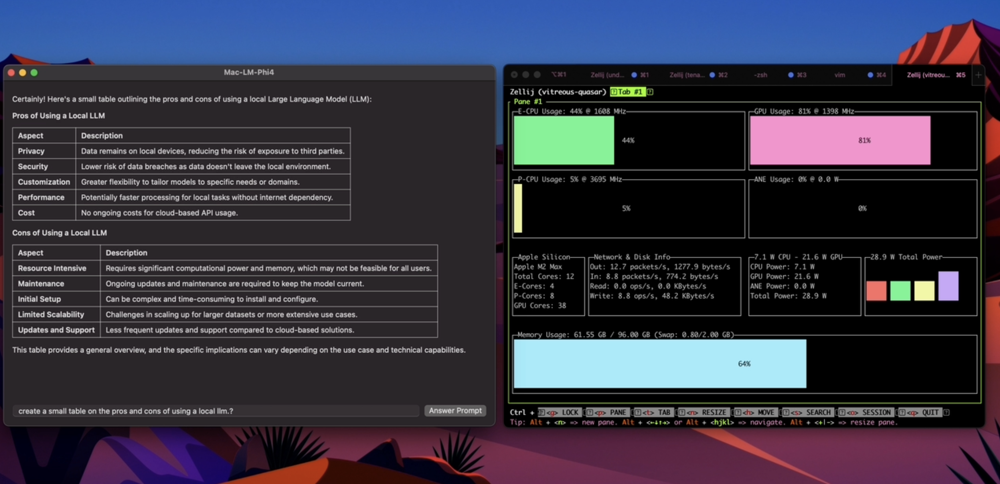

# Phi-4 macOS App with MLX Model Manager

  
*Screenshot of the macOS app running alongside mactop*

A sample Swift (macOS) application demonstrating how to download, load, and run Microsoft’s [Phi-4 language model](https://techcommunity.microsoft.com/blog/aiplatformblog/introducing-phi-4-microsoft%E2%80%99s-newest-small-language-model-specializing-in-comple/4357090) using the [MLX Model Manager](https://github.com/kunal732/MLX-Model-Manager). The app provides a simple SwiftUI interface for prompting Phi-4 and viewing text completions.

## Table of Contents

1. [Overview](#overview)
2. [Features](#features)
3. [Requirements](#requirements)
4. [Installation](#installation)
5. [Usage](#usage)
6. [License](#license)
7. [Additional Resources](#additional-resources)

---

## Overview

**Phi-4** is a small language model developed by Microsoft, focusing on providing concise and domain-specific completions. By integrating **MLX Model Manager**, this app manages the download, caching, and inference process for the Phi-4 model in a streamlined manner.

---

## Features

- **Easy Model Management**: Downloads and loads the Phi-4 model via MLX Model Manager.
- **Simple SwiftUI Interface**: Prompt the model and view generated text completions.
- **Progress Indicators**: Displays download progress and generation progress.
- **Markdown-Enabled Output**: Displays model output in Markdown format.

---

## Requirements

- **macOS 13 (Ventura)** or later
- **Xcode 14** or later
- An internet connection (for initial model download)

---

## Installation

1. **Clone this repository** (or download the ZIP and unzip locally):

    ```bash
    git clone https://github.com/kunal732/mlx-swift-phi4
    cd phi4-macos-demo
    ```

2. **Open the project** in Xcode:

    ```bash
    open phi4-macos-demo.xcodeproj
    ```

3. **Resolve Swift Package Dependencies**:  
   Xcode should automatically fetch the MLX Model Manager package from GitHub.

4. **Build & Run** in Xcode:
    - Select the macOS scheme (e.g., *phi4-macos-demo*)
    - Press *Cmd+R* (or click the *Play* button)

---

## Usage

1. When you launch the app, it will attempt to **download** the Phi-4 model automatically if it’s not already on your machine.
2. Once the download completes, the **Answer Prompt** button becomes active.
3. **Enter any prompt** (e.g., “Why is the sky blue?”) in the text field.
4. Press **Return** or click **Answer Prompt** to generate a completion using Phi-4.
5. Observe the **progress indicator** if the model is still loading or generating text.

---

## License

This sample app is provided under the [MIT License](LICENSE). Microsoft’s Phi-4 model usage may be subject to additional terms. Refer to the [Microsoft blog post](https://techcommunity.microsoft.com/blog/aiplatformblog/introducing-phi-4-microsoft%E2%80%99s-newest-small-language-model-specializing-in-comple/4357090) for details on licensing and usage constraints of Phi-4.

---

## Additional Resources

- **MLX Model Manager**: [GitHub Repository](https://github.com/kunal732/MLX-Model-Manager)
- **Phi-4 Introduction**: [Microsoft TechCommunity Blog](https://techcommunity.microsoft.com/blog/aiplatformblog/introducing-phi-4-microsoft%E2%80%99s-newest-small-language-model-specializing-in-comple/4357090)

Enjoy experimenting with Phi-4 on macOS! If you encounter issues, open an [Issue](https://github.com/YourUsername/phi4-macos-demo/issues) or submit a Pull Request. Contributions are welcome.


